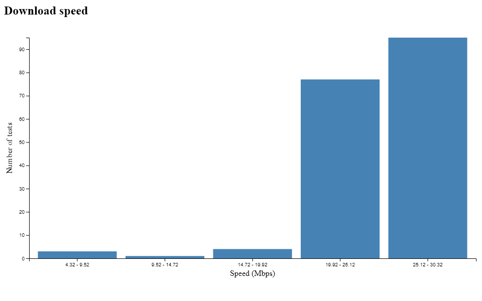

# Record the speed of your Wi-Fi connection

Think your Wi-Fi connection is slow and want a record to show your internet provider? Look no further :smiley:.

Each time you record the WiFi's speed the results are appended to a `records.txt` file in JSON format. A set of charts can then be generated from this data.

```
[
  {"ping":38,"download":21.2,"upload":18,"day":"24/06/2019","time":"16:50"},
  {"ping":39,"download":22,"upload":17.6,"day":"24/06/2019","time":"17:50"},
  {"ping":54,"download":22.8,"upload":18,"day":"24/06/2019","time":"18:50"},
  ...
]
```


## Install
```
npm install --global record-wifi-speed
```

## Usage

#### Arguments
- wifiName: The name of the Wi-Fi network you wish to record the speed of. For example `PLUSNET-1234`.
- resultsDirectory: The directory which will contain the results of the speed tests and the generated charts. For example `C:\Users\Bob\results`. The directory will be generated with the following content:

```bash
results/
├── records.txt
└── charts
    ├── download.html
    ├── download.png
    ├── download.svg
    ├── ping.html
    ├── ping.png
    ├── ping.svg
    ├── upload.html
    ├── upload.png
    └── upload.svg
```

### Node
```js
const { speedTest, generateCharts } = require('record-wifi-speed')

const wifiName = '...'
const resultsDirectory = '...'

speedTest({ wifiName, resultsDirectory })
generateCharts({ resultsDirectory })
```

### CLI
> You must have installed record-wifi-speed globally to run it on the CLI.
```
rws-run <wifiName> <resultsDirectory>
rws-charts <resultsDirectory>
```

### Executable
> You must have installed record-wifi-speed globally to run the executable.

The command `rws-package` creates an executable called `record-wifi-speed.exe` in your current directory.
```
rws-package
./record-wifi-speed.exe <wifiName> <resultsDirectory>
```

You might want to create a scheduled task which runs this executable periodically (for example with Windows Task Scheduler). It would then record your Wi-Fi speed in the background every period.

## Updating from v1 to v2
See [release notes](https://github.com/sievins/record-wifi-speed/releases/tag/v2.0.0)
